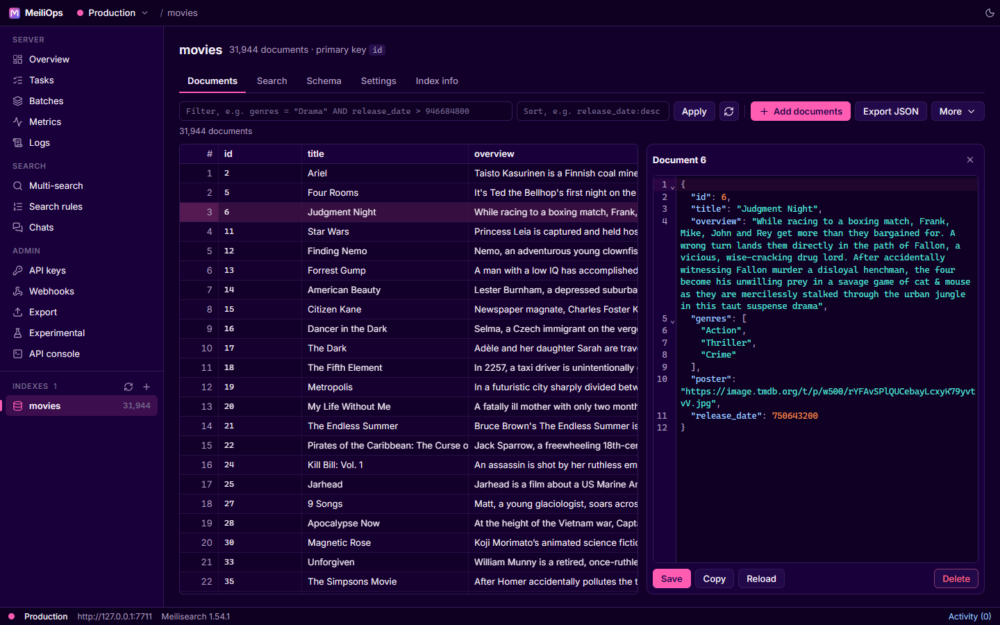
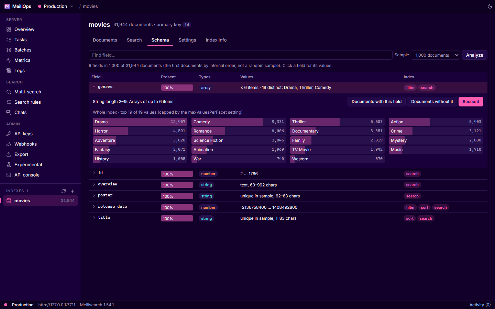
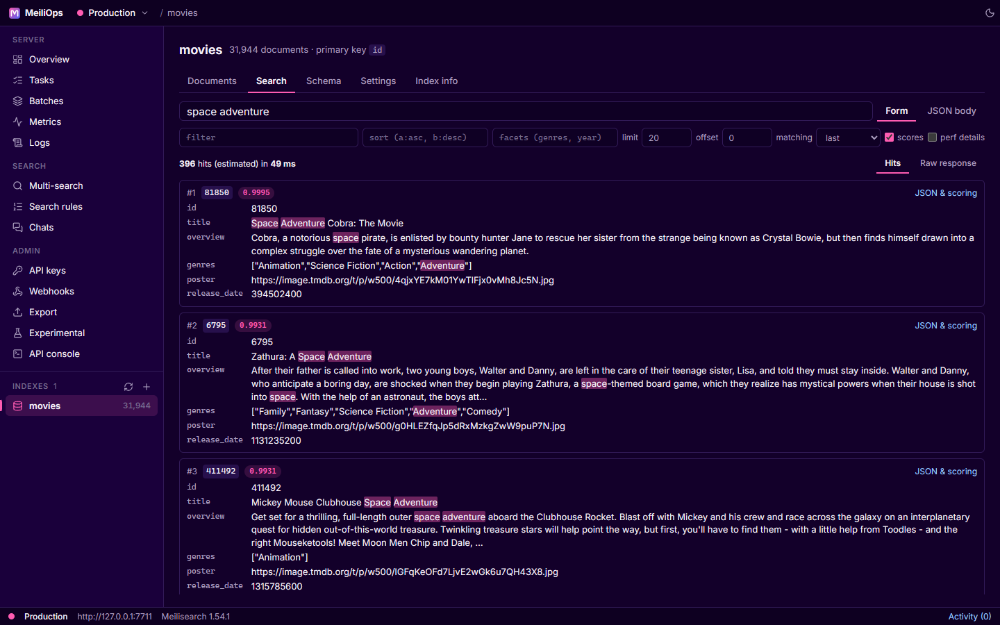
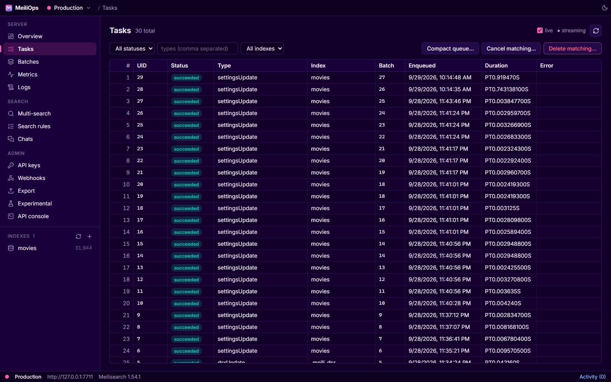
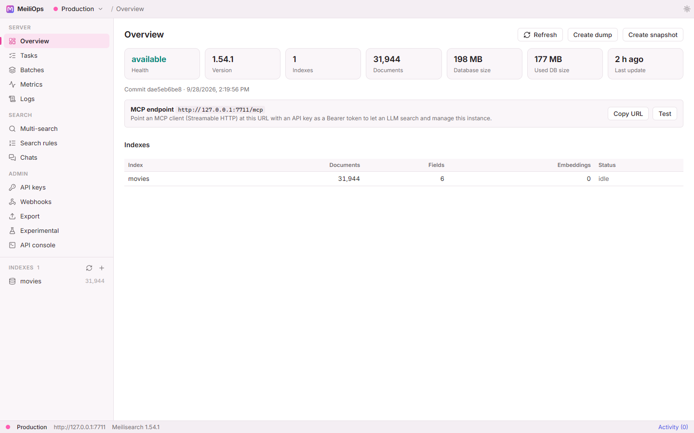

<p align="center">
  
</p>

<h1 align="center">MeiliOps</h1>

<p align="center">
  <b>The desktop admin app for <a href="https://www.meilisearch.com">Meilisearch</a>.</b><br />
  Browse documents, tune settings, watch tasks and run local instances.<br />
  Native, fast and light on memory. No Electron.
</p>

<p align="center">
  <a href="https://github.com/SrilalS/MeiliOps/releases/latest"></a>
  <a href="https://github.com/SrilalS/MeiliOps/actions/workflows/ci.yml"></a>
  
  
  <a href="LICENSE"></a>
</p>

<p align="center">
  <a href="https://srilals.github.io/MeiliOps/"><b>Documentation</b></a> ·
  <a href="https://github.com/SrilalS/MeiliOps/releases/latest"><b>Download</b></a> ·
  <a href="https://srilals.github.io/MeiliOps/guide/getting-started">Getting started</a> ·
  <a href="https://srilals.github.io/MeiliOps/development/">Contributing</a>
</p>



## Why MeiliOps

Meilisearch ships a search preview, but no full admin tool. MeiliOps is that tool, in the spirit of MongoDB Compass and pgAdmin:

- 🧭 **The whole API.** Every stable Meilisearch operation has a screen (140 of 143 in v1.54; the other 3 are Enterprise-only and reachable from the built-in API console). CI enforces it on every release.
- ⚡ **Native and lightweight.** Tauri 2 and SolidJS: a 3 MB installer and about 145 MB of RAM at idle, most of it the system WebView.
- 🔐 **Keys stay in your keychain.** API keys go to Windows Credential Manager, macOS Keychain or the Secret Service, never to a config file.
- 🕵️ **No telemetry.** MeiliOps talks to your servers and GitHub (update check, Meilisearch downloads), nothing else. [Every host it contacts](https://srilals.github.io/MeiliOps/reference/security#network-access).

## Features

| | |
|---|---|
| 📄 **Documents** | Virtualized grid for large indexes, filter and sort, JSON editor, import from JSON / NDJSON / CSV, bulk delete, export |
| 🔎 **Search playground** | Search-as-you-type with filters, sort, facets, hybrid and semantic search, ranking-score details, similar documents |
| 🧬 **Schema** | Field types, fill rates, value ranges and top values; exact facet counts; click a value to see matching documents; one-click "make filterable" |
| ⚙️ **Settings** | Every index setting with changes highlighted against the server, re-index warnings, and a template tester for embedders |
| 📋 **Tasks and batches** | Live updates, filters, cancel and delete by filter, progress bars |
| 🔑 **API keys** | Create, edit and delete keys; generate tenant tokens locally |
| 📈 **Operations** | Prometheus metrics dashboard, live logs, export to another instance, webhooks, dumps and snapshots, experimental features |
| 🧪 **Search features** | Multi-search (federated), search rules, chat workspaces with a streaming playground |
| 🖥️ **Local instances** | Run any Meilisearch version natively (SHA-256 verified binaries, side by side) or in Docker / Podman, each instance with its own port, key and launch flags |
| 🛟 **Resilient connections** | Detects a server going away, keeps your place, and reconnects on its own |
| 🌗 **Themes** | System, light and dark, in Meilisearch's colors |

<table>
  <tr>
    <td></td>
    <td></td>
  </tr>
  <tr>
    <td></td>
    <td></td>
  </tr>
</table>

## Install

> [!IMPORTANT]
> MeiliOps is in **beta** (0.x). It's used daily on Windows; the macOS and Linux builds have had less real-world use. Expect rough edges and please [report them](https://github.com/SrilalS/MeiliOps/issues).

Download the latest installer from **[Releases](https://github.com/SrilalS/MeiliOps/releases/latest)**:

| Platform | File |
|---|---|
| Windows 10 / 11 (x64) | `MeiliOps_<version>_x64-setup.exe` (per-user, no admin rights needed) |
| macOS | `MeiliOps_<version>_aarch64.dmg` (Apple Silicon) or `_x64.dmg` (Intel) |
| Linux (x64) | `.deb`, `.rpm` or `.AppImage` |

From 0.4 on, MeiliOps updates itself: an **Update** button appears in the title bar when a new release is out, and every update is verified against the release signing key.

> [!NOTE]
> Builds aren't code-signed yet. On Windows, choose **More info → Run anyway** in the SmartScreen prompt; on macOS, right-click the app and choose **Open** the first time. [More help](https://srilals.github.io/MeiliOps/guide/troubleshooting).

MeiliOps supports the **latest stable Meilisearch** (currently 1.54).

## Development

The app is TypeScript end to end; the Rust shell is under 400 lines and you shouldn't need to touch it.

```bash
cd app
npm install
npm run dev          # UI in a browser at http://localhost:1420
npm run tauri dev    # the desktop app
npm run typecheck
npm run coverage     # which Meilisearch operations have a screen
```

Prerequisites: Node.js 20+, Rust via [rustup](https://rustup.rs), and on Windows the MSVC build tools. See the [contributing guide](https://srilals.github.io/MeiliOps/development/) and [architecture notes](https://srilals.github.io/MeiliOps/development/architecture).

| Folder | What |
|---|---|
| [`app/`](app) | The desktop app (Tauri 2 + SolidJS) |
| [`docs/`](docs) | This project's documentation site (VitePress) |
| [`Research/`](Research) | Design research: API surface, framework evaluation, performance measurements |

## License

[MIT](LICENSE). MeiliOps is an independent project and is not affiliated with or endorsed by Meilisearch.
