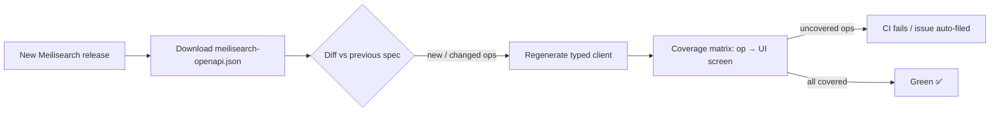

# 01 — Meilisearch API Surface (Coverage Inventory)

> Snapshot as of **2026-09-28**. Latest release: **v1.54 (2026-09-21)**.
> Sources: [Changelog](https://www.meilisearch.com/docs/changelog/changelog), [API reference index](https://www.meilisearch.com/docs/llms.txt), [OpenAPI page](https://www.meilisearch.com/docs/reference/api/openapi.md).

---

## ⚠️ Things that will bite us

1. 🏃 **Releases are weekly.** Between v1.35 and v1.54 there were 19 minor releases in about 8 months. A hand-maintained client will rot.
2. 💥 **Experimental APIs break without a major version bump.** Dynamic Search Rules were restructured in **v1.50** (`priority`→`precedence`, split `conditions`) and again in **v1.54** (`actions` became `{pin, scale}`). `POST /fields` changed its response shape in v1.35.
3. 🏢 **Community and Enterprise binaries have been separate since v1.28.** Sharding, replication and S3 snapshots are Enterprise only (BUSL-1.1). The app must detect the edition and hide or disable those features.
4. 🧭 **Routes behave differently in a cluster.** With `network.leader` set, `useNetwork` defaults to `true`. Non-leaders return `not_a_leader` on writes. Document fetches span all shards by default (v1.50+).
5. 🔑 **Permission-aware UI.** A key may hold only some of the ~57 `actions`. The UI must degrade gracefully on 403s, not crash.
6. 🩺 **`/health` returns HTTP 500 after task-queue compaction** (v1.43+) to force a restart. Don't show that as "server dead" without context.
7. 🧩 **Not everything is reachable over HTTP.** CLI flags and env vars (`MEILI_EXPERIMENTAL_*`, `--upgrade-db`, max indexing memory…) can only be set at launch.

---

## ✅ Key enabler: official per-release OpenAPI spec

- 📄 Latest: `https://www.meilisearch.com/docs/assets/release-assets/meilisearch-openapi.json`
- 🏷️ Per version: every GitHub release ships `meilisearch-openapi.json` as a release asset

**Implication:** generate the typed client from the spec, and have CI **diff the spec for each new release** against our implemented-operations list. That turns "100% coverage" into a measurable, automated metric instead of a promise.

---

## 📚 Route inventory (grouped)

Legend: 🟢 stable · 🧪 experimental (feature flag) · 🏢 Enterprise-only

### 📂 Indexes
| Method | Path | Notes |
|---|---|---|
| GET/POST | `/indexes` | list (paginated), create |
| GET/PATCH/DELETE | `/indexes/{uid}` | PATCH updates the primary key, **rename** (v1.18) |
| POST | `/swap-indexes` | atomic swap; supports rename mode |
| POST | `/indexes/{uid}/fields` | field metadata, paginated (v1.33, reshaped in v1.35) |
| GET | `/indexes/{uid}/stats` | `indexSize`, `usedIndexSize` (v1.53) |
| POST | `/indexes/{uid}/compact` | LMDB defrag (v1.23) |

### 📄 Documents
| Method | Path | Notes |
|---|---|---|
| GET / POST | `/indexes/{uid}/documents`, `/documents/fetch` | filter, sort (v1.16), `ids`, `retrieveVectors`, `useNetwork` |
| GET/DELETE | `/indexes/{uid}/documents/{id}` | |
| POST / PUT | `/indexes/{uid}/documents` | add/replace vs add/update; JSON, NDJSON, CSV; `skipCreation` (v1.31); `customMetadata` (v1.26) |
| DELETE | `/indexes/{uid}/documents` | delete all |
| POST | `/documents/delete`, `/documents/delete-batch` | by filter / by ids |
| POST | `/indexes/{uid}/documents/edit` | 🧪 edit by function (Rhai) |

### 🔍 Search
| Method | Path | Notes |
|---|---|---|
| GET/POST | `/indexes/{uid}/search` | hybrid, vector, geo, facets (wildcards v1.50), `showRankingScoreDetails`, `showPerformanceDetails` (v1.35) |
| POST | `/multi-search` | federated, remote federated, `federation.page`, `distinct`, personalization |
| POST | `/indexes/{uid}/facet-search` | `exhaustiveFacetCount`, `useNetwork` |
| GET/POST | `/indexes/{uid}/similar` | embedding similarity |
| POST | `/render-template` | 🧪 test document templates and embedders (v1.48) |

### ⚙️ Settings (`/indexes/{uid}/settings[/sub]`, each has GET / PUT-or-PATCH / DELETE=reset)
`displayedAttributes` · `searchableAttributes` · `filterableAttributes` (granular objects, v1.14) · `sortableAttributes` · `distinctAttribute` · `rankingRules` (incl. `attributeRank`, `wordPosition`, v1.36) · `synonyms` · `stopWords` · `typoTolerance` (`disableOnNumbers`) · `pagination` · `faceting` · `facetSearch` · `prefixSearch` · `proximityPrecision` · `searchCutoffMs` · `dictionary` · `separatorTokens` · `nonSeparatorTokens` · `localizedAttributes` · `embedders` (openAi, huggingFace, ollama, rest, userProvided, composite, multimodal fragments) · `chat` · `foreignKeys` 🧪 · `vectorStore` 🧪

### ⏳ Tasks and batches
| Method | Path | Notes |
|---|---|---|
| GET | `/tasks`, `/tasks/{uid}` | rich filters, `reverse`, `batchUid` |
| GET | `/tasks/{uid}/documents` | task document payload |
| POST | `/tasks/cancel` · DELETE `/tasks` | by filter |
| GET | `/tasks/stream`, `/batches/stream` | 🧪 **SSE live updates** (v1.52), ideal for the monitor UI |
| POST | `/tasks/compact` | 🧪 (v1.40) |
| GET | `/batches`, `/batches/{uid}` | `progressTrace` (v1.20) |

### 🔑 Keys
`GET/POST /keys` · `GET/PATCH/DELETE /keys/{uidOrKey}`
Actions (57): `*`, `search`, `documents.{*,add,get,delete}`, `indexes.{*,create,get,update,delete,swap,compact}`, `tasks.{*,get,cancel,delete,compact}`, `settings.{*,get,update}`, `stats.*`, `metrics.*`, `dumps.*`, `snapshots.*`, `version`, `keys.{create,get,update,delete}`, `experimental.{get,update}`, `export`, `network.{get,update}`, `chatCompletions`, `chats.{*,get,delete}`, `chatsSettings.{*,get,update}`, `*.get`, `webhooks.{*,get,create,update,delete}`, `fields.post`, `dynamicSearchRules.{*,get,create,update,delete}`
➕ **Tenant tokens** are JWTs signed client-side with an API key. The app can generate them locally, with no server route needed.

### 🤖 AI and conversational
| Path | Notes |
|---|---|
| `/chats`, `/chats/{ws}`, `/chats/{ws}/settings` | workspaces (v1.15+) |
| `POST /chats/{ws}/chat/completions` | OpenAI-compatible, SSE streaming |
| `/mcp` | Model Context Protocol endpoint (v1.54) |

### 🎯 Dynamic Search Rules (curation) 🧪
`GET /dynamic-search-rules` · `DELETE /dynamic-search-rules` (all) · `GET/PATCH/DELETE /dynamic-search-rules/{uid}`. Actions `pin` and `scale` (v1.54); conditions `query`, `time` and `filter` (v1.51). Scales to 75k+ rules. **Most volatile API; design for schema churn.**

### 🌐 Instance, ops and cluster
| Path | Notes |
|---|---|
| `GET /health`, `GET /version`, `GET /stats` | stats: `showInternalDatabaseSizes`, `sizeFormat=human` (v1.44) |
| `GET /metrics` | 🧪 Prometheus text format |
| `POST /logs/stream`, `DELETE /logs/stream`, `POST /logs/stderr` | 🧪 live log streaming and target change |
| `POST /dumps`, `POST /snapshots` | |
| `POST /export` | push documents to a remote instance (v1.16) |
| `GET/PATCH /experimental-features` | runtime feature flags |
| `GET/PATCH /network` + network control | 🏢 sharding, replication, remotes with availability (v1.42), topology change tasks |
| `/webhooks` CRUD | v1.17 |

### 📨 Useful headers
- `Authorization: Bearer <key>`
- `Meili-Include-Metadata` → query uid, index uid, primary key in search responses (v1.24)

---

## 🧮 Coverage-matrix sizing
- About **180+ documented operations** (per the docs index)
- About **25 settings sub-resources × 3 verbs**
- About **15 experimental feature flags** to surface in an "Experimental" panel
