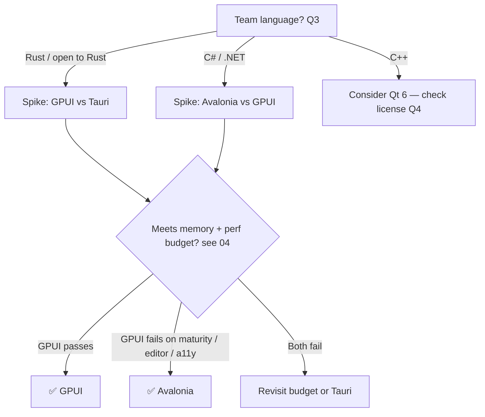

# 03 — Desktop UI Framework Evaluation

> **TL;DR:** Shortlist **3 candidates** for a benchmark spike:
> 1. 🥇 **Rust + GPUI (gpui-component)**: best performance and memory ceiling, same language as Meilisearch
> 2. 🥈 **C# + Avalonia 12 (NativeAOT)**: most mature and lowest delivery risk
> 3. 🥉 **Rust + Tauri 2**: webview baseline, fastest to build, weakest on memory
>
> The final pick depends on **team language (Q3)** and **spike numbers** (`04`).

---

## ⚠️ Things that will bite us

1. 🧠 **Tauri's "30–40 MB" headline figures usually measure only the host process.** On Windows, WebView2 spawns browser, renderer and GPU processes (`msedgewebview2.exe`). Realistic **total** memory is about **80–200 MB**. Always measure the whole process tree.
2. 🧱 **The hard UI parts** are (a) a virtualized grid over millions of documents, (b) a JSON/code editor with highlighting and completion, and (c) charts. Native toolkits vary widely here, and this decides the choice more than raw benchmarks do.
3. 🔄 **Renderer regressions happen.** Slint 1.18 jumped from about 19 MB to 155 MB on Windows because of a wgpu/D3D default change ([issue #13470](https://github.com/slint-ui/slint/issues/13470)). Pin versions and benchmark in CI.
4. 🧪 **Young Rust GUI stacks are pre-1.0.** GPUI and iced APIs churn. Budget for upgrades.
5. ⚖️ **Licensing:** Qt (LGPL/commercial) and Slint (GPLv3 / royalty-free / commercial) need checking against our distribution model (Q4).

---

## 🧮 Candidate matrix

Memory values are **indicative, from public reports. Not yet verified.** Our spike will measure them.

| # | Framework | Lang | Rendering | Idle RAM (est.) | Data grid | JSON / code editor | Maturity | Cross-plat | Verdict |
|---|---|---|---|---|---|---|---|---|---|
| 1 | 🦀 **GPUI + gpui-component** | Rust | GPU (DX11 on Windows) | ~30–70 MB | ✅ virtualized table, 100k+ rows | ✅ built-in code editor (tree-sitter) | 🟡 young, but ships in Zed and Longbridge Pro | ✅ Win/Mac/Linux | **Shortlist** |
| 2 | 🟣 **Avalonia 12** (+NativeAOT) | C# | Skia / Composition | ~50–110 MB | ✅ DataGrid, TreeDataGrid | ✅ AvaloniaEdit | 🟢 mature (v12, Apr 2026) | ✅ | **Shortlist** |
| 3 | 🦀 **Tauri 2** | Rust + TS | WebView2 | ~80–200 MB (tree) | ✅ AG Grid / TanStack | ✅ Monaco / CodeMirror | 🟢 mature | ✅ | **Shortlist (baseline)** |
| 4 | 🦀 **Slint** | Rust / C++ | Skia / femtovg / software | ~20–50 MB | 🟡 basic StandardTableView | ❌ no rich editor | 🟢 1.x, embedded-first | ✅ | Reject: editor gap |
| 5 | 🟩 **Qt 6** (Widgets/QML) | C++ (or Rust via cxx-qt) | Native / RHI | ~40–90 MB | ✅ QTableView (best in class) | ✅ QScintilla / KSyntaxHighlighting | 🟢 very mature | ✅ | Viable if C++ team; licensing check |
| 6 | 🦀 **egui** | Rust | Immediate mode GPU | ~20–50 MB | ✅ `egui_extras::TableBuilder` | 🟡 basic highlighting | 🟢 stable-ish | ✅ | Fallback: "dev-tool" look, weaker accessibility |
| 7 | 🦀 **iced** | Rust | wgpu | ~40–80 MB | ❌ no production grid | ❌ | 🟡 | ✅ | Reject |
| 8 | 🔷 **Flutter desktop** | Dart | Impeller/Skia | ~80–150 MB | 🟡 third-party | 🟡 | 🟢 | ✅ | Reject: memory, non-native feel |
| 9 | 🐹 **Wails 3** | Go + TS | WebView2 | ~80–200 MB | same as Tauri | same | 🟡 | ✅ | Reject: Tauri equivalent, weaker ecosystem |
| 10 | 🪟 **WinUI 3** | C# | DirectX | ~60–120 MB | ✅ | 🟡 | 🟢 | ❌ Windows only | Reject: breaks cross-plat |
| 11 | ☕ **Compose Multiplatform** | Kotlin | Skia on JVM | ~200 MB+ | 🟡 | 🟡 | 🟢 | ✅ | Reject: JVM memory |
| 12 | ⚡ **Electron** | TS | Chromium | 150–400 MB+ | ✅ | ✅ | 🟢 | ✅ | ❌ **Excluded by requirement** |

Sources: [Slint issue #13470](https://github.com/slint-ui/slint/issues/13470), [Avalonia 12 blog](https://avaloniaui.net/blog/avalonia-12), [gpui-component](https://crates.io/crates/gpui-component), [Tauri vs Electron 2026](https://rustify.rs/articles/rust-tauri-vs-electron-2026), [Desktop frameworks 2026](https://www.youngju.dev/blog/culture/2026-05-14-desktop-app-frameworks-2026-tauri-electron-wails-compose-multiplatform-maui-flutter-comparison-deep-dive-2026.en)

---

## 🥇 Why GPUI leads on paper

- ⚡ **Performance ceiling:** GPU-rendered at 120 fps and built for Zed. Same class as TablePlus.
- 🧩 **gpui-component covers our hard parts:** virtualized table, code editor, tree, dock/tabs layout, charts, 60+ components. It is battle-tested in a commercial trading desktop app.
- 🦀 **Rust synergy with Meilisearch itself:**
  - Official `meilisearch-sdk` crate
  - Meilisearch's own `filter-parser` crate (MIT, in the Meilisearch repo) could enable **offline filter-syntax validation and highlighting** that matches the server exactly *(verify reuse feasibility)*
  - `reqwest` + `eventsource` for the SSE task/batch streams
- ⚠️ **Risks:** pre-1.0 API churn; thin docs; smaller hiring pool; Windows backend newer than macOS; accessibility less proven.

## 🥈 Why Avalonia is the safe bet

- 🟢 Mature, well-documented, XAML/MVVM, big .NET talent pool.
- 📉 NativeAOT: roughly 50% smaller download (UniGetUI: 58 MB → 28 MB installer), faster start, no idle CPU burn in v12.
- ⚠️ **Risks:** the GC's memory floor is higher than Rust's; NativeAOT trimming friction with reflection-heavy libraries; the .NET Meilisearch SDK lags new APIs (we'd generate from OpenAPI anyway).

## 🥉 Why keep Tauri as a baseline

- 🏎️ Fastest feature velocity: web ecosystem for grids, editors and charts.
- 📏 It gives us a **reference point** to prove the native options are actually better.
- ⚠️ **Risk:** likely misses the memory budget, and may be seen as "Electron-lite", which goes against the spirit of the requirement.

---

## 🧭 Decision flow

