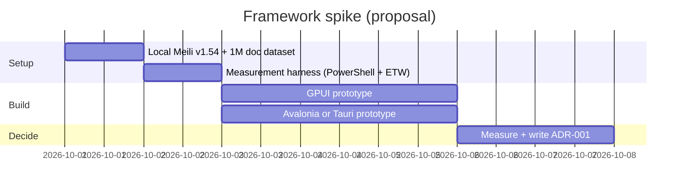

# 04 — Performance & Memory Budget + Benchmark Spike

> **TL;DR:** Define hard budgets now, then run a **~1–2 week spike** that builds the same 3 screens in each shortlisted framework and measures them on Windows 11.

---

## 🎯 Proposed budgets (Windows 11 x64)

| Metric | Budget | How measured |
|---|---|---|
| 🧠 Idle memory, 1 connection, no index open | **< 60 MB** | Private working set, **summed over the entire process tree** |
| 🧠 Documents grid open, 1M-doc index, scrolled end to end | **< 150 MB** | Same, peak |
| 🧠 After closing the grid (leak check) | returns within **+10%** of idle | Same, after 30 s |
| 🚀 Cold start to interactive | **< 500 ms** | Timestamp from process start to first frame with connection list |
| 🖱️ Grid scroll | **60 fps, p99 frame < 16 ms** | Frame-time instrumentation / PresentMon |
| ⌨️ Search-as-you-type round trip (local server) | **< 50 ms UI overhead** above server time | App tracing spans |
| 📦 Installer size | **< 30 MB** | MSIX / MSI |
| 💤 Idle CPU | **~0%** | Process Explorer over 60 s |

---

## ⚠️ Measurement gotchas

1. 🌳 **Measure the whole process tree.** WebView2 child processes (`msedgewebview2.exe`) must be included, or Tauri looks artificially good.
2. 📏 **Use Private Working Set, not Working Set.** Shared DLL pages inflate Working Set.
3. 🔥 **Warm vs cold start:** cold means right after reboot or a standby-list flush (RAMMap "Empty Standby List").
4. 🧮 **Same dataset for every candidate:** the Meilisearch `movies.json` sample, synthetic-expanded to 1M docs.

---

## 🧪 Spike scope (identical in every candidate)

1. 🔌 **Connection screen:** add, test and save; key stored in Windows Credential Manager
2. 📄 **Documents grid:** virtualized, 1M docs via paginated `/documents/fetch`, column auto-detect from `/fields`, JSON side panel with highlighting
3. ⏳ **Live task monitor:** SSE on `/tasks/stream` (fallback: polling), 10k-task list, filter by status

---

## 🛠️ Measurement harness (sketch)

- PowerShell sampling of `Get-CimInstance Win32_Process` for the process tree (by `ParentProcessId`), summing `PrivatePageCount` every 250 ms
- Output: CSV → a Markdown results table in `Research/spike-results.md` → **ADR-001: UI framework**
