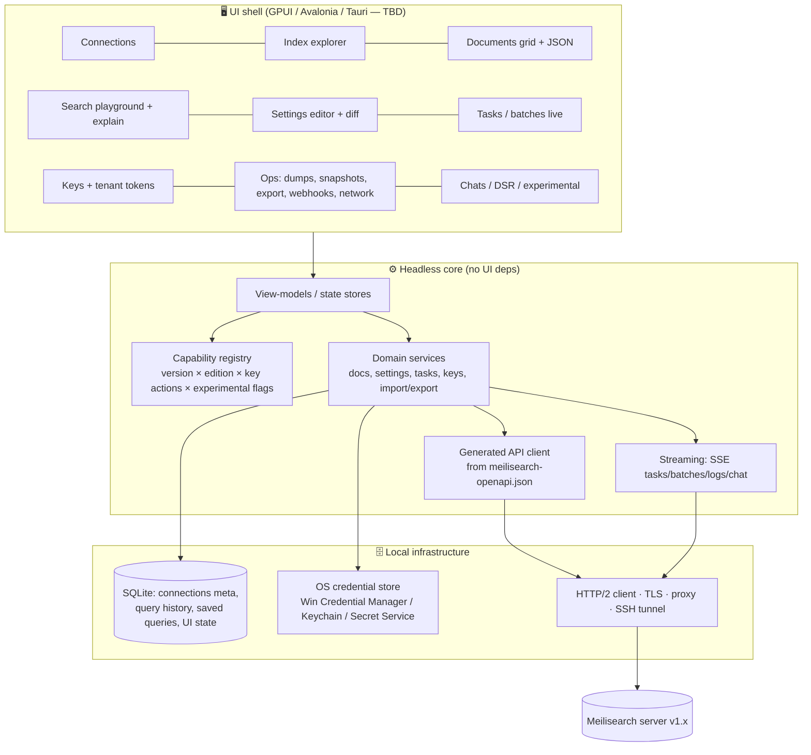
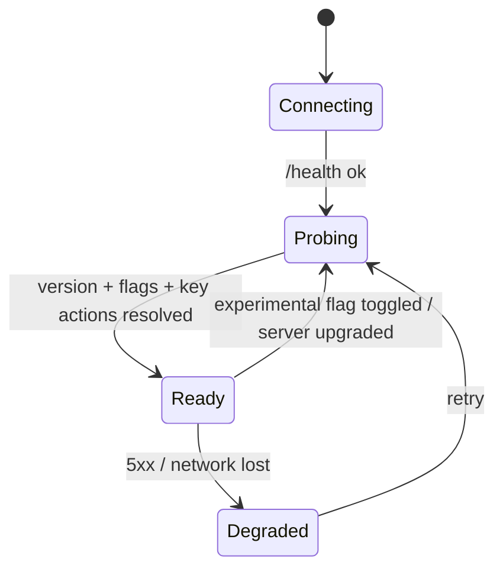

# 05 — Architecture (Framework-Agnostic Draft)

> **TL;DR:** A thin UI over a **headless core**. The core owns the generated API client, the **capability registry** (what this server and key can do) and local state. The UI framework becomes swappable, and most logic is testable without a GUI.

---

## 🧱 Layered view

---

## 🏷️ Capability registry (the "compatibility" requirement)

On connect, and whenever something changes, compute a **capability set**:

| Input | Source |
|---|---|
| 🔢 Server version | `GET /version` |
| 🏢 Edition (Community / Enterprise) | Probe `GET /network` / build info |
| 🧪 Enabled experimental features | `GET /experimental-features` |
| 🔑 Key permissions | `GET /keys/{self}` if permitted; else learn from 403s |
| 🌐 Cluster role | `network.leader` / self |

Each UI feature declares a requirement, e.g. `requires: { minVersion: "1.52", experimental: "…", action: "tasks.get" }`. The registry answers: ✅ available · 🔒 no permission · ⬆️ needs newer server · 🧪 enable flag (one-click toggle) · 🏢 Enterprise only.

---

## 🔌 API client strategy

1. 🧬 **Codegen from the per-release OpenAPI spec**, keeping **one schema version per supported Meilisearch minor**, or a union with version annotations.
2. 🧩 **Hand-written shims** only where the spec is wrong or missing (track them explicitly).
3. 🧾 **Coverage matrix** (`coverage.yaml`): `operationId → screen/feature → test`. CI fails on an uncovered new operation.
4. 🔁 **Contract tests** against real Meilisearch Docker images for each supported version (matrix CI).

---

## ⚡ Performance patterns

- 📜 **Virtualize everything:** the documents grid, task list, synonyms (75k DSR rules!) and logs
- 🧵 **Stream, don't buffer:** NDJSON import/export streamed from disk; never load a whole file into memory
- 🗜️ **Lazy JSON:** keep raw bytes per row; parse or highlight only visible cells
- 🔄 **Cancel stale requests:** search-as-you-type cancels the in-flight request
- 📡 **Prefer SSE** (`/tasks/stream`) over polling, with a polling fallback for servers older than v1.52

---

## 🔐 Security

- Master and admin keys only in the OS credential store; the SQLite file holds references
- Tenant tokens signed locally (JWT HS256 with the parent key); never send the parent key anywhere else
- Visual danger cues (red header) when connected with a master key or to "prod"-tagged connections
- Confirmation plus typed-name check for destructive ops (delete index, delete all documents, swap)
