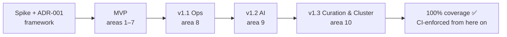

# 06 — Feature Map (API → Screens) & Release Slicing

> **TL;DR:** 10 screen areas cover the whole API. Proposed slicing: **MVP = daily admin loop** (connect → browse → search → settings → tasks → keys). Ops, AI and cluster features follow.

---

## 🗺️ Screen areas

| # | Area | Covers (API) | Slice |
|---|---|---|---|
| 1 | 🔌 **Connections** | health, version, capability probe | MVP |
| 2 | 📂 **Index explorer** | indexes CRUD, rename, swap, stats, fields, compact | MVP |
| 3 | 📄 **Documents** | list/fetch/get, add/replace/update, delete (id/filter/batch/all), import CSV/JSON/NDJSON | MVP |
| 4 | 🔍 **Search playground** | search, facets, facet-search, hybrid/vector, geo, ranking-score details, performance details, similar | MVP |
| 5 | ⚙️ **Settings editor** | all ~25 settings, diff preview, reindex warning, copy settings between indexes | MVP |
| 6 | ⏳ **Tasks & batches** | list/filter, SSE stream, cancel, delete, payload, progress trace, compact | MVP |
| 7 | 🔑 **Security** | keys CRUD with an action picker, tenant-token generator | MVP |
| 8 | 🛠️ **Operations** | dumps, snapshots, export, webhooks, metrics dashboard, log stream, experimental flags | v1.1 |
| 9 | 🤖 **AI** | embedders config, render-template tester, chat workspaces + chat playground, multi-search/federation builder, MCP info | v1.2 |
| 10 | 🎯 **Curation & cluster** | Dynamic Search Rules editor, foreign keys, network/sharding topology view | v1.3 (volatile APIs) |

---

## 🧭 Release slicing

The coverage gate becomes **blocking** once v1.3 ships. Before that it is a report.
